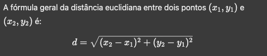
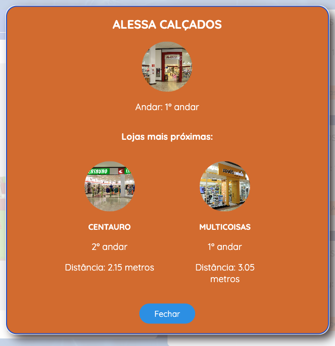

<h1> 📍 Zapt Tech: Desafio Técnico </h1>
<h2> 🔍   Instalação </h2>
Para a visualização do projeto, o primeiro passo é clonar o projeto a partir do link

```
https://github.com/graziellecafe/zapt-tech-test.git
```

Depois abra o projeto e vá até os diretórios de backend e frontend como mostrado abaixo

```js
cd backend
npm install
node server.js
```

Deve aparecer no terminal <b>"Servidor rodando na porta 3001.</b>

```js
cd frontend
npm install
npm start
```

Deve abrir o <b>http://localhost:3000/</b>, renderizando do lado esquerdo o mapa fornecido da <b> Zapt Tech</b> e do lado direito a renderização da <b>lista de lojas</b>.

No mapa do lado esquerdo temos a opção de visualizar o Mapa além das opções na parte inferior, como Início, Lista, Notícias e Mais.


<h2> 📝   Resolução dos Casos </h2>
<h3> 👩🏻‍💻 Caso 1 </h3>
<b>Apresentar Mapa</b>: Para isso, integrar via iFrame com o Mapa da Zapt Tech. As instruções de integração estão aqui:

```js
http://docs.zapt.tech/#ZaptMapsSDK
```

Dados para integração:

```js
- PLACE_ID: -ltvysf4acgzdxdhf81y
- API_KEY: 26ee8805-55f8-484a-a229-59d813131484
```

Para a resolução do Caso 1, foi codificado o componente <b>MapContainer.js</b> que integra via iframe o link disponibilizado na documentação o mapa de exemplo para resolução do desafio técnico pela Zapt Tech.

Foi adicionado algumas opções para ser mostrado junto ao mapa como <b>Início, Mapa, Lista, News e Mais</b> e a <b>opção de busca e seleção</b> entre os tipos de fornecedores: <b> Alimentação, Lojas e Serviços</b>.

```js
import React from "react";
import "../App.css";

export const MapContainer = () => {
  return (
    <div className="map-container">
      <iframe
        src="https://app.zapt.tech/#/map?placeId=-ltvysf4acgzdxdhf81y&search=true"
        title="Zapt Tech Map"
        style={{
          width: "100%",
          height: "100%",
          border: "none",
        }}></iframe>
    </div>
  );
};
```

O App.css é responsável pelo CSS de todo o código, de forma a utilizar <b>as cores e fundos usados na marca da Zapt Tech</b> em seu site afim de passar uma <b>identificação para o usuário</b>.

<h3> 👩🏻‍💻 Caso 2 </h3>
O Caso 2 a ser resolvido é <strong>listar todos os pontos de interesse (lojas) utilizando a API REST</strong>, método GET / interests.
<br><br>
Para a realização da obtenção dos dados vindos da API Zapt Tech foi utilizada a configuração da Arquitetura em Camadas, onde é organizado o código em diferentes níveis ou "camadas" para separar responsabilidades. Isso ajuda a manter o código mais limpo, reutilizável e fácil de entender.
<br><br>
Abaixo, a organização das pastas na parte do backend, necessária para fazer as requisições e chamadas à API da Zapt Tech e retornar ao cliente (frontend) as respostas.

```js
backend/
  ├── server.js
  └── .env
  └── src/
      ├── controllers/
      │   └── storeController.js
      ├── routes/
      │   └── storeRoutes.js
      ├── services/
      │   └── api.js
      ├── config/
      │   └── apiConfig.js
```

E agora a disponibilização de arquivos do lado do front end:

```
frontend/
  ├── App.js
  └── App.css
  └── index.js
  └── src/
      ├── components/
      │   └── MapContainer.js
          └── StoreDetails.js
          └── StoreList.js
      ├── hooks/
      │   └── useSearchInterests.js
      ├── images/
      │   └── bg-contato.jpg
      │   └── bg-site.jpg
      │   └── lista-lojas-zapt-tech.png
      │   └── tela-zapt-tech.png
      │   └── distancia-euclidiana.png
```

<br><br>
Agora, podemos visualizar do lado esquerdo o mapa disponibilizado com a possibilidade de navegar na parte inferior com Início, Mapa, Lista, Notícias e Mais.

Também podemos realizar busca das lojas na parte superior do mapa e do lado esquerdo podemos visualizar o solicitado, ou seja, a listagem de lojas feita através da requisição da API GET / interests com informações importantes como nome da loja, andar, coordenadas (para realizar o Caso 3) e tags informativas sobre a loja.
<br><br>


<h3> 👩🏻‍💻 Caso 3 </h3>
Para o caso 3, foi proposto mostrar informações da loja que foi selecionada na  lista. Nessa págna,também queremos que você exiba as duas lojas mais próximas da selecionada e a distância em linha reta. Para isso, nossa API retorna as coordenas XY (em pixel) da loja. Considere também que a escala é px/metro é 25.

Com isso, com as informações das lojas já está aparecendo na loja principal, foi criado um Modal simples que mostra apenas a foto da loja, o andar que ela se encontra, e as duas lojas mais próximas com sua devida distância em linha reta.

O código utilizado para realizar o cálculo de distância é o através do cálculo conhecido como **distância euclidiana** no contexto bidimensional. Como temos os valores de XYm podemos utilizar esses dados vindos da API para calcular a distência entre dois pontos em pixels, e depois converte o resultado para metros.



E para visualizarmos essas informações foi criado o componente Modal passando as informações necessárias para ele (está no arquivo frontend/src/components/StoreList.js). Podemos visualizar o Modal criado:



Por fim, chegamos ao fim do desafio técnico.Qualquer dúvida, entre em contao!

**Contato**: [Linkedin Grazielle Café](https://www.linkedin.com/in/graziellecafe/)
